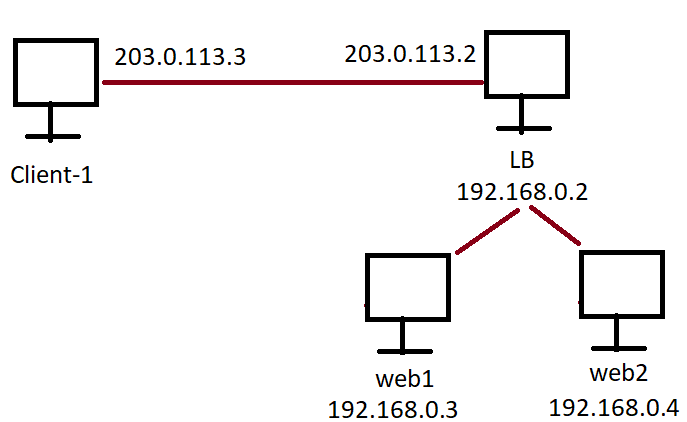

1. `docker compose up -d`
2. `docker exec -it client-1 bash` (May have some delay to use commands due to waiting packages were installed).
    - `ping arpo.com`
    - `curl arpo.com`
3. `docker compose down`
